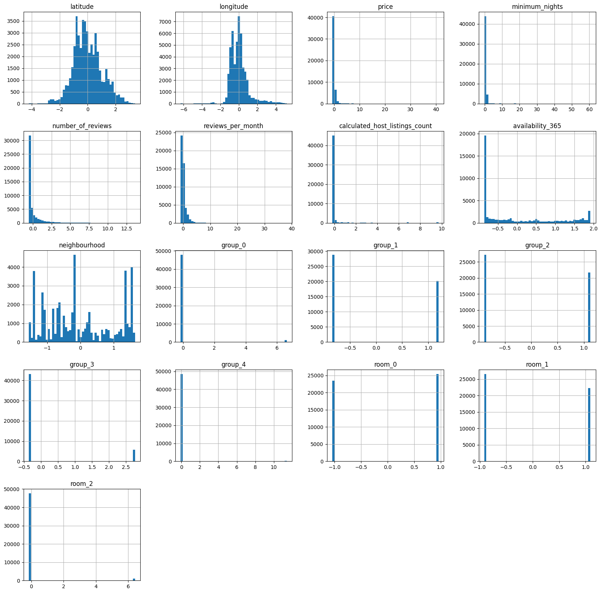
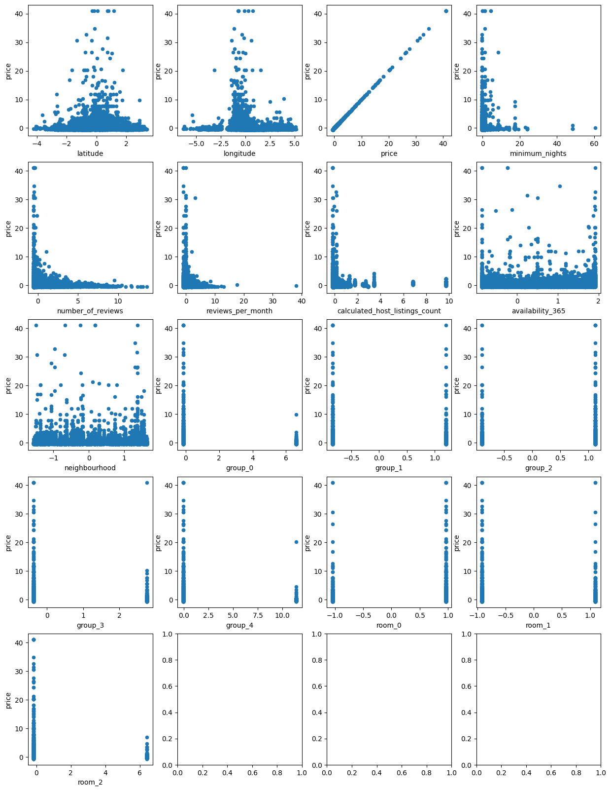

| Студент | Ильин И.О. |
|---------|--------|
| Группа  | М8О-406Б-19      |

# Задача
Вам предстоит руками проанализировать данные, визуализировать зависимости, построить новые признаки и сказать хватит ли вам этих данных, и если не хватит найти еще.

# Датасет
New York City Airbnb Open Data

# Описание входных данных:
- id – id апартаментов.
- name – название апартаментов.
- host ID – id хозяина.
- host_name – имя хозяина.
- neighbourhood_group – район Нью-Йорка.
- neighbourhood – окрестность.
- latitude – широта.
- longitude – долгота.
- room_type – тип апартаментов.
- price – цена апартаментов.
- minimum_nights – минимальное количество ночей.
- number_of_reviews – количество отзывов.
- last_review – дата последнего отзыва.
- reviews_per_month – количество отзывов за месяц.
- calculated_host_listings_count – количество записей на апартаменты.
- availability_365 – количество дней, когда апартаменты доступны для бронирования.

# Типы признаков:

## Категориальные
- name
- host_name
- neighbourhood_group – neighbourhood
- room_type – last_review

## Количественные
- id
- host_id
- latitude
- longitude
- price
- number_of_reviews – reviews_per_month
- calculated_host_listings_count
- availability_365

## Размер:
- Строк: 48895
- Столбцов: 16

# Решаемая задача

Задача предсказания - предсказать цену апартаментов (price).

Для решения поставленной задачи нам нужно оставить только те признаки, которые нам понадобятся:

- neighbourhood_group – neighbourhood
- latitude
- longitude
- room_type
- price
- minimum_nights
- number_of_reviews
- reviews_per_month
- calculated_host_listings_count 
- availability_365

Теперь, проанализировав данные, можно понять, что нам необходимо заполнить пропуски.

Будем заполнять reviews_per_month средним значением:

# Работа с категориальными признаками:

Нам следует переделать категориальные данные в числовые и пронормировать. room_type и neighbourhood_group будем переделывать с помощью one_hot_encoder'a, а neighbourhood с помощью label_encoder'a.

# Распределение признаков после нормировки

# Корреляция

# Зависимость главного значения от остальных

# Вывод

Данная лабораторная работа была довольно интересной. В ходе ее выполнения я попрактиковался в анализе и подготовке данных, научился выявлять статистические закономерности и наиболее важные признаки. Еще я понял, что для обработки признаков нужны знания статистики, например, чтобы строить различные сложные графики и уметь их понимать. Важно так же уметь создавать новые признаки из имеющихся и отбирать только самые нужные из изначальных.